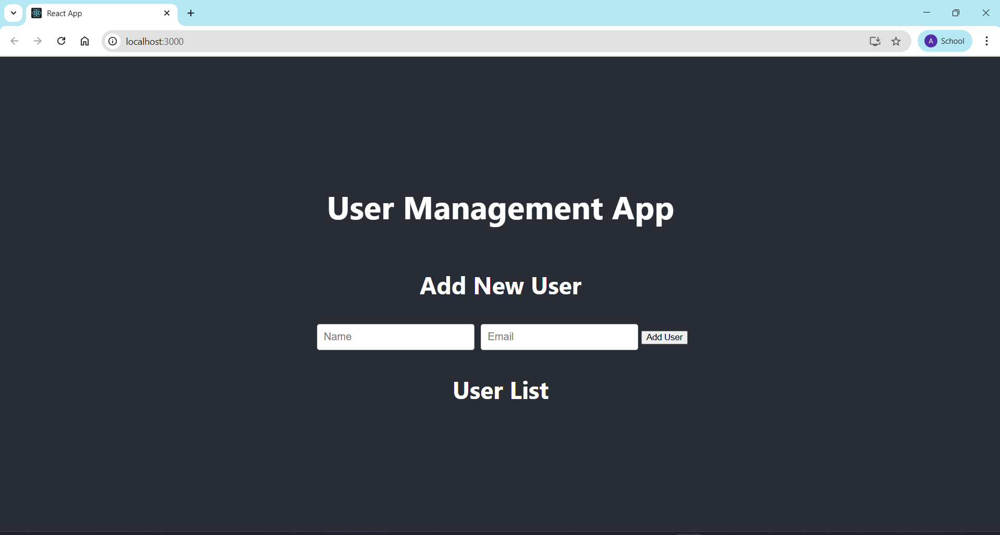

# User Management CRUD App 🧑‍💻

A simple, full-stack web application built with the MERN stack (MongoDB, Express.js, React, Node.js). This application allows users to perform the four basic CRUD (Create, Read, Update, Delete) operations on a list of users.

## Screenshot 📸



***
---

## ✨ Features

* **Create**: Add a new user with a name and email to the database.
* **Read**: View a list of all existing users.
* **Update**: Edit the information of an existing user.
* **Delete**: Remove a user from the list.

***
---

## 💻 Technologies Used

This project was built using the following technologies:

* **Frontend**:
    * 
    * 
* **Backend**:
    * 
    * 
* **Database**:
    * 
    * 

***
---

## 🚀 Getting Started

To get a local copy up and running, follow these simple steps.

### Prerequisites

Make sure you have Node.js and MongoDB installed on your machine.
* Node.js: [https://nodejs.org/](https://nodejs.org/)
* MongoDB: [https://www.mongodb.com/try/download/community](https://www.mongodb.com/try/download/community)

### Installation

1.  **Clone the repository**
    ```sh
    git clone [https://github.com/YourUsername/my-crud-app.git](https://github.com/YourUsername/my-crud-app.git)
    cd my-crud-app
    ```
2.  **Install Backend Dependencies**
    ```sh
    cd server
    npm install
    ```
3.  **Set Up Environment Variables**
    * Create a `.env` file inside the `server` folder.
    * Add your MongoDB connection string to it:
        ```
        MONGO_URI="your_mongodb_connection_string_here"
        ```
4.  **Install Frontend Dependencies**
    ```sh
    cd ../client
    npm install
    ```

### Running the Application

You will need two terminals running simultaneously.

1.  **Run the Backend Server** (from the `server` folder)
    ```sh
    npm run dev
    ```
    The server will start on `http://localhost:5001`.

2.  **Run the Frontend Client** (from the `client` folder)
    ```sh
    npm start
    ```
    The React app will open in your browser at `http://localhost:3000`.
